# AlgoVerse

### Interactive Data Structures & Algorithms Visualization Workspace

AlgoVerse is an interactive DSA learning workspace that lets users **see algorithms execute step by step** instead of only reading their source code or viewing the final result.

The workspace combines algorithm visualizations, C++ implementations, execution explanations, live variables, complexity information, and an interactive input playground in one interface.

---

## ✨ Features

- 🔎 Interactive searching visualizations
- 🔄 Sorting algorithm visualizations
- 🔗 Linked List operations
- 📚 Stack operations
- 🚶 Queue operations
- 🌳 Binary Tree visualizations
- 🌲 Binary Search Tree operations
- 🏗️ Heap visualizations
- 🌐 Graph traversal visualizations
- 🧠 Step-by-step algorithm execution
- 🎯 Current code-line highlighting
- 📊 Complexity information
- 🧮 Live execution variables
- 🎮 Interactive Input Playground
- ⏮️ Previous / ▶️ Play / ⏭️ Next / Restart controls
- 🎨 Interactive 3D visualizations for supported structures

---

## 🎥 Demo

The following demos show the finished AlgoVerse workspace in action.

### Linear Search

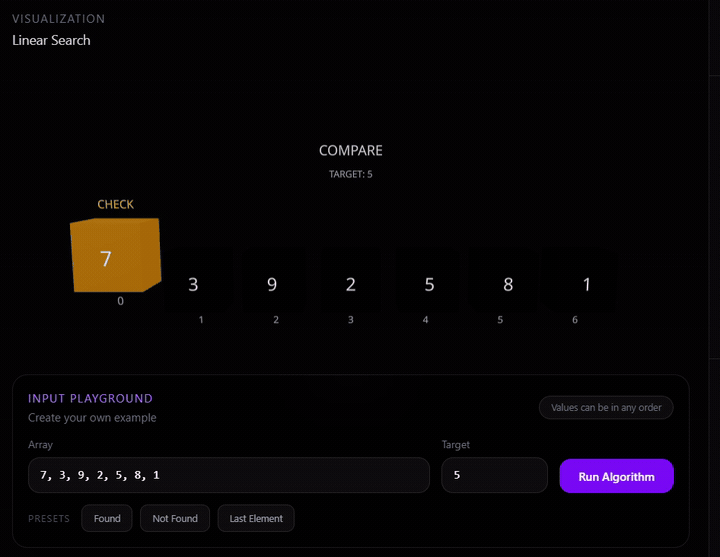

### Bubble Sort

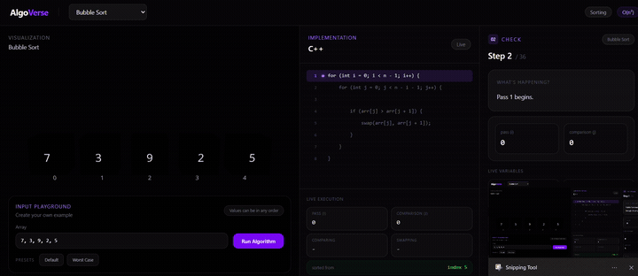

### Linked List Deletion

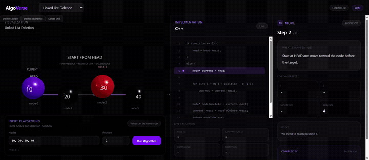

### BST Delete

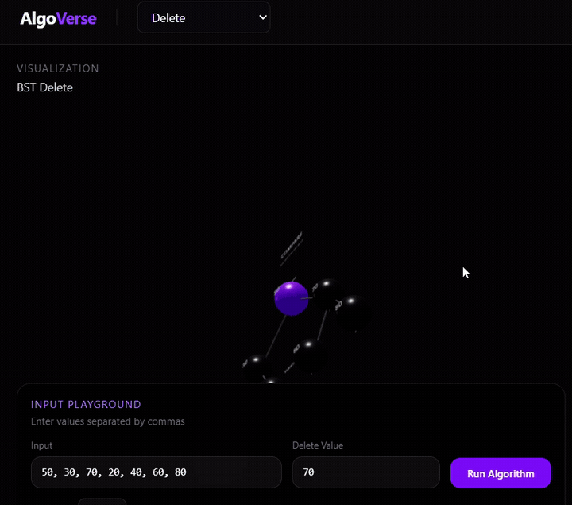

### Breadth First Search

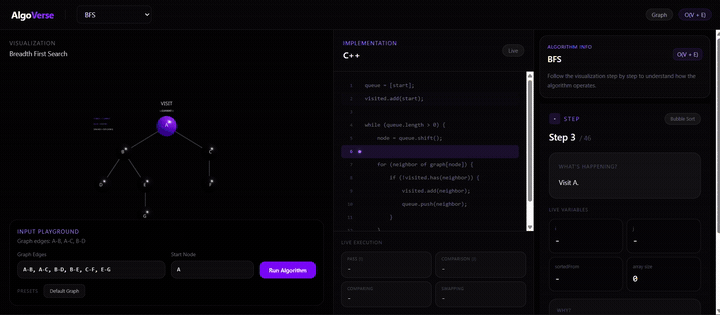

### Stack Peek

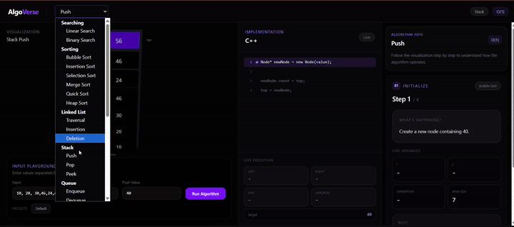

---

## 🖼️ Screenshots

### Linear Search

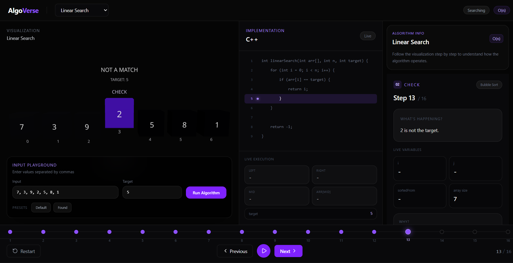

### Binary Search Tree Search


### Depth First Search

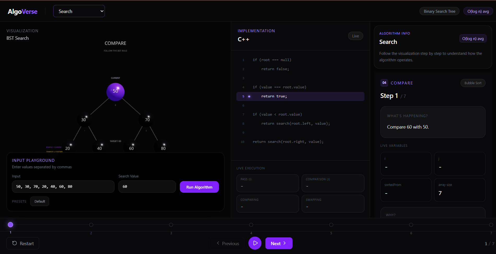

### Queue Dequeue

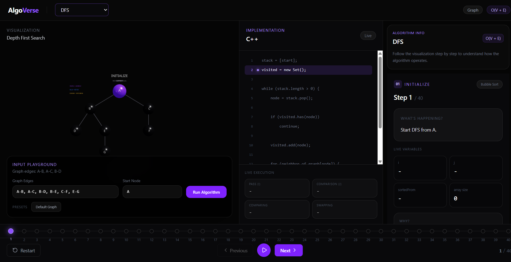

### Quick Sort

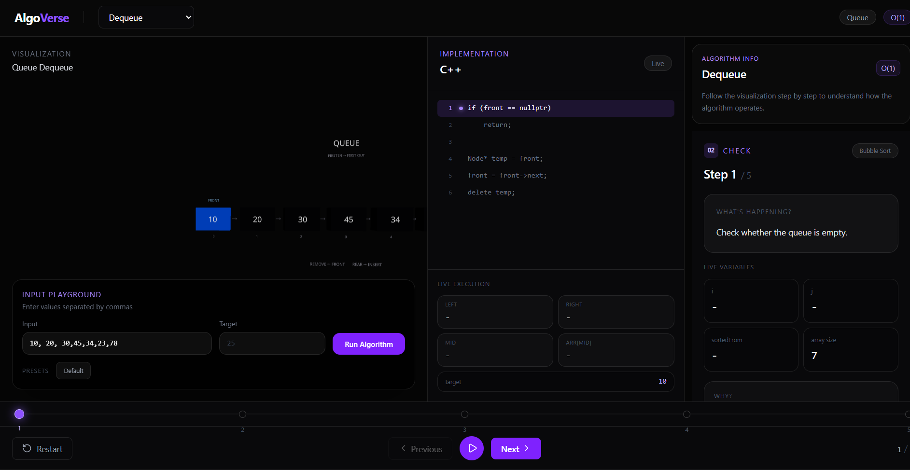

### Heap Sort

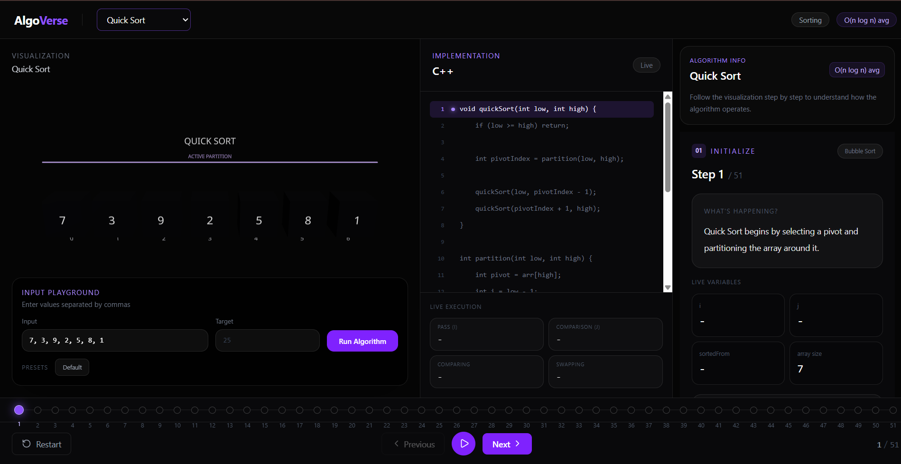

### Stack Peek

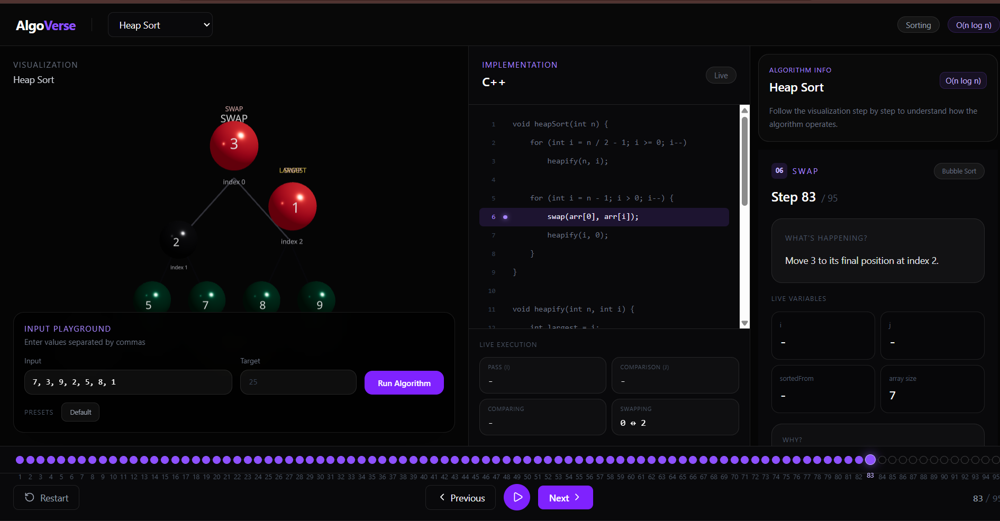

---

## 🧠 Data Structures & Algorithms

| Category | Implemented / Demonstrated |
|---|---|
| Searching | Linear Search, BST Search |
| Sorting | Bubble Sort, Quick Sort, Heap Sort |
| Linked List | Deletion |
| Stack | Peek and stack operations |
| Queue | Dequeue and queue operations |
| Binary Tree | Traversal and visualization |
| Binary Search Tree | Search, insertion/deletion operations |
| Heap | Heap operations and Heap Sort |
| Graph | BFS and DFS |

---

## 🔬 How AlgoVerse Works

Each algorithm is represented as a sequence of execution states.

```text
Select Algorithm
       ↓
Provide Input
       ↓
Run Algorithm
       ↓
Generate Execution Steps
       ↓
Visualize Current State
       ↓
Highlight Relevant Code
       ↓
Explain Current Step
       ↓
Move to Next Step
       ↓
Algorithm Complete
```

This allows the user to connect the algorithm's source code with the changes happening inside the visualization.

---

## 💻 Code + Visualization

The workspace displays the algorithm implementation alongside its visualization.

For each execution step, the interface can show:

- Current algorithm state
- Relevant source-code line
- Current data structure state
- Explanation of the operation
- Live execution variables

For example, during a graph traversal, the visualization can show the current node while the implementation panel displays the corresponding traversal logic.

---

## 🎮 Input Playground

AlgoVerse allows users to experiment with their own inputs instead of relying only on predefined examples.

Depending on the selected algorithm, the playground can accept:

- Array values
- Search targets
- Linked List values
- Deletion positions
- Tree values
- BST values
- Graph edges
- Starting graph node
- Stack / Queue values

Presets are also available for supported algorithms.

---

## ⏯️ Step-by-Step Controls

The execution timeline provides controls for navigating through an algorithm:

```text
⏮ Previous
▶ Play
⏭ Next
↻ Restart
```

The current execution step and total number of steps are displayed so users can inspect the algorithm one operation at a time.

---

## 📊 Complexity Information

AlgoVerse displays complexity information for the selected algorithm.

Examples demonstrated in the project include:

| Algorithm / Operation | Complexity |
|---|---|
| Linear Search | O(n) |
| BST Search | O(log n) avg |
| DFS | O(V + E) |
| Queue Dequeue | O(1) |
| Quick Sort | O(n log n) avg |
| Heap Sort | O(n log n) |

---

## 🛠️ Tech Stack

- **React**
- **JavaScript / JSX**
- **Vite**
- **Tailwind CSS**
- **Three.js**
- **React Three Fiber / Drei**
- **GSAP**
- **C++** for displayed algorithm implementations

---

## 📂 Project Structure

```text
AlgoVerse/
│
├── src/
│   ├── algorithms/
│   ├── components/
│   ├── scenes/
│   ├── store/
│   └── ...
│
├── public/
│
├── docs/
│   ├── demos/
│   │   ├── linear-search.gif
│   │   ├── bubble-sort.gif
│   │   ├── linked-list.gif
│   │   ├── bst.gif
│   │   ├── bfs.gif
│   │   └── stack.gif
│   │
│   ├── screenshots/
│   │   ├── linear-search.png
│   │   ├── bst-search.png
│   │   ├── dfs.png
│   │   ├── queue-dequeue.png
│   │   ├── quick-sort.png
│   │   ├── heap-sort.png
│   │   └── stack-peek.png
│   │
│   └── DOCUMENTATION.md
│
├── README.md
├── package.json
├── .gitignore
└── .env.example
```

---

## ⚙️ Installation

### 1. Clone the repository

```bash
git clone <YOUR_GITHUB_REPOSITORY_URL>
```

### 2. Open the project

```bash
cd AlgoVerse
```

### 3. Install dependencies

```bash
npm install
```

### 4. Start the development server

```bash
npm run dev
```

The application will then be available at the local development URL provided by Vite.

---

## 🏗️ Build for Production

To create a production build:

```bash
npm run build
```

The project has been build-tested using the Vite production build process.

---

## 📖 Documentation

For detailed information about the project, implementation approach, algorithms, visualization system, development challenges, and solutions:

**[Read the full documentation →](./docs/DOCUMENTATION.md)**

---

## 🧩 Development Challenges

During development, several issues were encountered and resolved, including:

- Missing algorithm module imports
- Missing store references
- React maximum update depth errors
- Visualization scaling and camera framing
- Dark-theme dropdown styling
- Production build warnings

The detailed development history and solutions are documented in:

**[docs/DOCUMENTATION.md](./docs/DOCUMENTATION.md)**

---

## 🔮 Future Scope

AlgoVerse currently focuses on fundamental DSA concepts.

Potential future projects or expansions could explore:

- Advanced graph algorithms
- Dynamic programming visualizations
- Shortest-path algorithms
- Minimum spanning tree algorithms
- Advanced tree algorithms
- Algorithm benchmarking
- More visualization modes
- Additional interactive learning tools

Advanced algorithms are intentionally kept outside the scope of the current basic DSA project.

---

## 🎯 Project Goal

The goal of AlgoVerse is simple:

> **Don't just read the algorithm. Watch it execute.**

By combining source code, visual state changes, execution steps, and explanations, AlgoVerse provides a more interactive way to understand fundamental Data Structures and Algorithms.

---

## 👨‍💻 Author

**Shashwat Ghadge**

B.Tech Computer Science & Engineering

---

## 📄 License

Add your preferred license here before publishing the repository.
